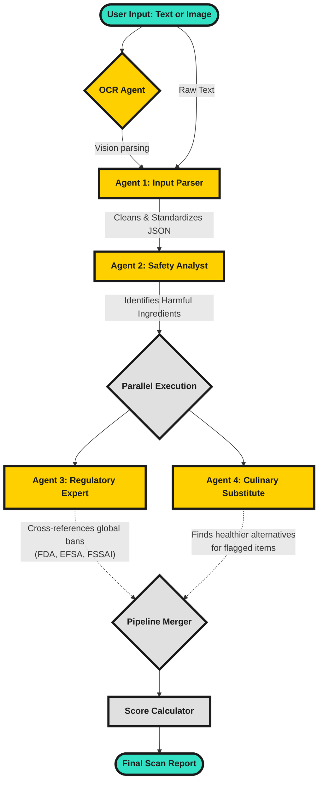

# Healthify 🧪
**AI-Powered Food Safety Scanner**

Healthify is a production-ready, agentic AI platform that allows consumers to scan food ingredient lists (text or photos) and receive a comprehensive safety analysis. It flags harmful substances, identifies global regulatory bans, and suggests healthier alternatives using a multi-agent orchestration pipeline.

Built to win hackathons — featuring a **Neo-Brutalist 2D UI**, local JSON-based auth/database system, an admin dashboard, and user scan history.

---

## 🏗️ Agentic AI Architecture

Healthify uses a **4-Agent Sequential & Parallel Pipeline** powered by `gemini-1.5-flash`. Instead of relying on one massive, slow, and hallucination-prone prompt, the workload is horizontally split across four specialized agents.



### Flow Breakdown
1. **Agent 1 (Input/Sanitization):** Takes messy, unstructured ingredient strings and structures them into a strict JSON array.
2. **Agent 2 (Safety Analysis):** Assesses the health risks of each structured item, returning simple reasons and strict severities (`safe`, `low`, `medium`, `high`).
3. **Agent 3 (Regulatory):** Checks custom region parameters for partial or full country bans *(Runs in parallel)*.
4. **Agent 4 (Substitute Suggestions):** Generates practical 1-sentence substitute recommendations for any ingredient flagged as un-safe *(Runs in parallel)*.

---

## ✨ Features

*   **Neo-Brutalist UI:** A heavy, striking, 2D design language that breaks away from generic "AI glassmorphism."
*   **Vision OCR:** Uses Gemini Vision to let users upload photos of ingredient labels to instantly extract text.
*   **Authentication System:** JWT-based login/signup with local JSON storage (`users.json`).
*   **Admin Dashboard:** Dedicated `/admin` route providing real-time stats on total users, total scans, grade distributions, and a global scan history table.
*   **User History:** Logged-in users can browse and re-open reports of their past scans.
*   **Shareable Reports:** 1-click clipboard copying to easily warn friends about bad ingredients.

---

## 🛠️ Tech Stack

- **Frontend:** React 19, TypeScript, Vite, Tailwind CSS, React Router v6
- **Backend:** Node.js, Express, TypeScript, JWT (JSON Web Tokens)
- **AI Integration:** Google Gemini API (`@google/generative-ai`)
- **Database:** Local JSON File Storage (`/data/users.json` and `/data/scans.json`)

---

## 🚀 Getting Started

### 1. Install Dependencies
Install modules for both the `client` and `server` folders:
```bash
npm run install:all
```

### 2. Environment Variables
Create a `.env` file in the `server` directory:
```env
GEMINI_API_KEY=your_actual_gemini_api_key_here
PORT=3001
JWT_SECRET=your_jwt_secret_phrase
```

### 3. Run the Servers
You can run the backend and frontend simultaneously.

**Start the Backend (Port 3001):**
```bash
npm run dev:server
```
*(On first run, the server automatically generates a default admin account: `admin@healthify.com` / password: `admin123`)*

**Start the Frontend (Port 5173):**
*In a second terminal window:*
```bash
npm run dev:client
```

Navigate to [http://localhost:5173](http://localhost:5173).

---

## 📖 API Reference

### Authentication
*   `POST /api/auth/signup`: Create a new user (returns JWT token and user info).
*   `POST /api/auth/login`: Authenticate existing user.
*   `GET /api/auth/me`: Validate token and retrieve active user profile.

### Scanning / AI Pipeline
*   `POST /api/scan`: Run the 4-agent pipeline. If a `Bearer Token` is passed, the scan is saved to the user's history.
*   `POST /api/ocr`: Submit a base64 food label image to be parsed by Gemini Vision.

### History & Admin
*   `GET /api/scans/history`: Fetch the authenticated user's scan history.
*   `GET /api/admin/stats`: Get global analytics overview (Admin only).
*   `GET /api/admin/scans`: Get full global scan history sheet (Admin only).
*   `GET /api/admin/users`: Get all registered users (Admin only).

---
*Built with ❤️ and AI. Not a substitute for actual medical advice.*
